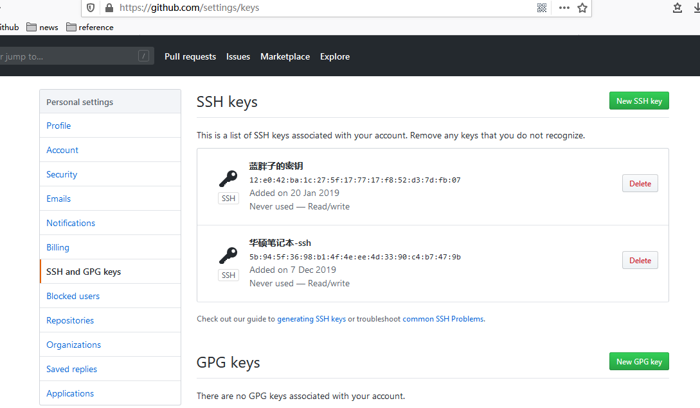

# Git-SSH登录Github

配置前，需要配置git config --global user.email 以及git config --global user.name

1. 检查密钥

   ```shell
    ls -al ~/.ssh 
   ```

2. 生成

   ```shell
   ssh-keygen -t rsa -b 4096 -C "your_email@example.com"
   ```

3. 把~/.ssh/id_rsa.pub拷贝到

4. 测试 

   1. ```shell
      ssh -T git@github.com	
      ```

      