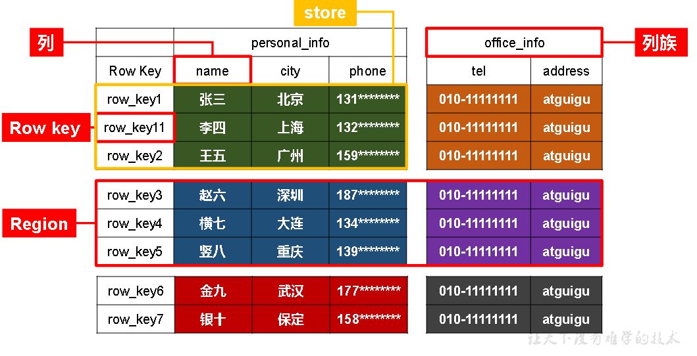
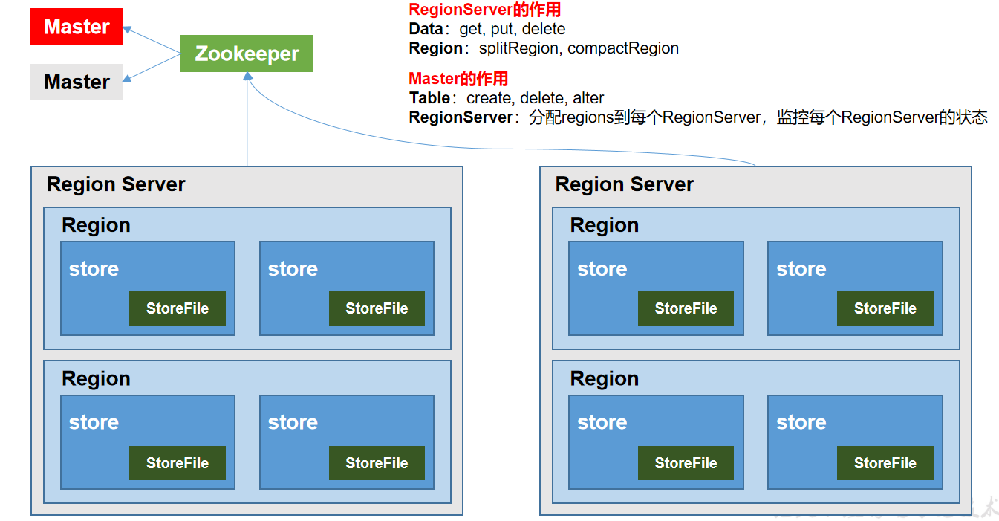
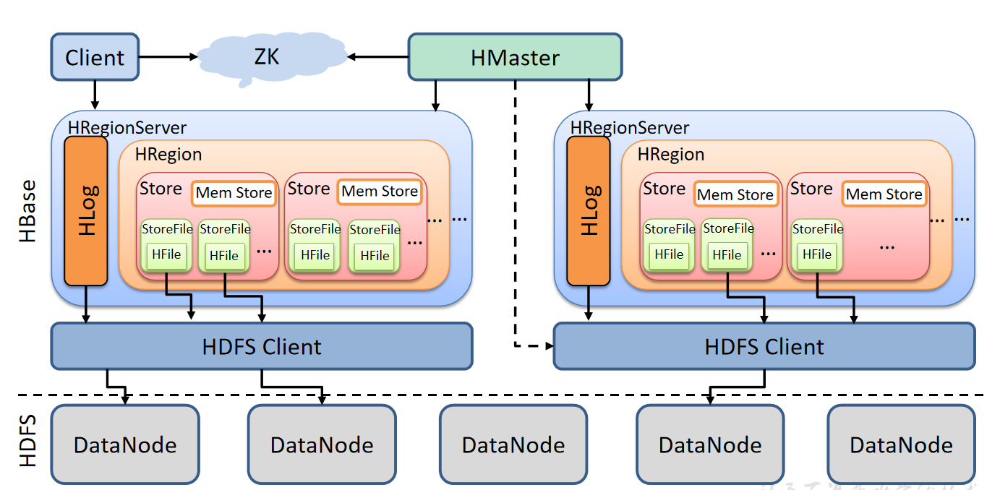
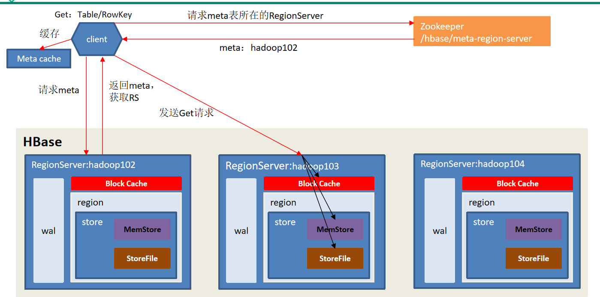
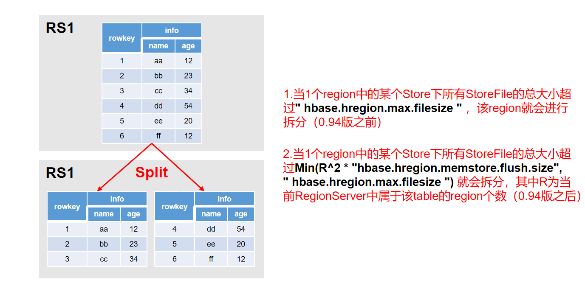

# HBase

[TOC]

## 概述

HBase是一种分布式、可扩展、支持海量数据存储的NoSQL数据库。

## 数据模型

逻辑上，HBase的数据模型同关系型数据库很类似，数据存储在一张表中，有行有列。<br/>
但从HBase的底层物理存储结构（K-V. 来看，HBase更像是一个multi-dimensional map。

1. NameSpace
    1. 命名空间，类似于关系型数据库的DataBase概念，每个命名空间下有多个表。HBase有两个自带的命名空间，分别是“hbase”和“default”，“hbase”中存放的是HBase内置的表，“default”表是用户默认使用的命名空间。
2. Region
    1. 类似于关系型数据库的表概念。不同的是，HBase定义表时只需要声明列族即可，不需要声明具体的列。这意味着，往HBase写入数据时，字段可以动态、按需指定。因此，和关系型数据库相比，HBase能够轻松应对字段变更的场景。
3. Row
    1. HBase表中的每行数据都由一个RowKey和多个Column（列. 组成，数据是按照RowKey的字典顺序存储的，并且查询数据时只能根据RowKey进行检索，所以RowKey的设计十分重要。
4. Column
    1. HBase中的每个列都由Column Family(列族)和Column Qualifier（列限定符. 进行限定，例如info：name，info：age。建表时，只需指明列族，而列限定符无需预先定义。
5. Time Stamp
    1. 用于标识数据的不同版本（version. ，每条数据写入时，如果不指定时间戳，系统会自动为其加上该字段，其值为写入HBase的时间。
6. Cell
    1. 由{rowkey, column Family：column Qualifier, time Stamp} 唯一确定的单元。cell中的数据是没有类型的，全部是字节码形式存贮。

### HBase逻辑结构



### HBase物理存储结构


## 架构

1. Region Server
    1. Region Server为 Region的管理者，其实现类为HRegionServer，主要作用如下:
    2. 对于数据的操作：get, put, delete；
    3. 对于Region的操作：splitRegion、compactRegion。
2. Master
    1. Master是所有Region Server的管理者，其实现类为HMaster，主要作用如下：
	2. 对于表的操作：create, delete, alter
    3. 对于RegionServer的操作：分配regions到每个RegionServer，监控每个RegionServer的状态，负载均衡和故障转移。
3. Zookeeper
    1. HBase通过Zookeeper来做Master的高可用、RegionServer的监控、元数据的入口以及集群配置的维护等工作。
4. HDFS
    1. HDFS为HBase提供最终的底层数据存储服务，同时为HBase提供高可用的支持。



### 架构原理

1. StoreFile
    1. 保存实际数据的物理文件，StoreFile以HFile的形式存储在HDFS上。每个Store会有一个或多个StoreFile（HFile. ，数据在每个StoreFile中都是有序的。
2. MemStore
    1. 写缓存，由于HFile中的数据要求是有序的，所以数据是先存储在MemStore中，排好序后，等到达刷写时机才会刷写到HFile，每次刷写都会形成一个新的HFile。
3. WAL
    1. 由于数据要经MemStore排序后才能刷写到HFile，但把数据保存在内存中会有很高的概率导致数据丢失，为了解决这个问题，数据会先写在一个叫做Write-Ahead logfile的文件中，然后再写入MemStore中。所以在系统出现故障的时候，数据可以通过这个日志文件重建。



## 写流程

1. Client先访问zookeeper，获取hbase:meta表位于哪个RegionServer。
2. 访问对应的RegionServer，获取hbase:meta表，根据读请求的namespace:table/rowkey，查询出目标数据位于哪个RegionServer中的哪个Region中。<br/>并将该table的region信息以及meta表的位置信息缓存在客户端的meta cache，方便下次访问。
3. 与目标RegionServer进行通讯；
4. 将数据顺序写入（追加. 到WAL；
5. 将数据写入对应的MemStore，数据会在MemStore进行排序；
6. 向客户端发送ack；
7. 等达到MemStore的刷写时机后，将数据刷写到HFile。

 

## 读流程

1. Client先访问zookeeper，获取hbase:meta表位于哪个Region Server。
2. 访问对应的Region Server，获取hbase:meta表，根据读请求的namespace:table/rowkey，查询出目标数据位于哪个Region Server中的哪个Region中。并将该table的region信息以及meta表的位置信息缓存在客户端的meta cache，方便下次访问。
3. 与目标Region Server进行通讯；
4. 分别在Block Cache（读缓存. ，MemStore和Store File（HFile. 中查询目标数据，并将查到的所有数据进行合并。此处所有数据是指同一条数据的不同版本（time stamp. 或者不同的类型（Put/Delete. 。
5.  将从文件中查询到的数据块（Block，HFile数据存储单元，默认大小为64KB. 缓存到Block Cache。
6. 将合并后的最终结果返回给客户端。

 

## MemStore Flush

MemStore刷写时机：

1. 当某个memstore的大小达到了hbase.hregion.memstore.flush.size（默认值128M），其所在region的所有memstore都会刷写。
当memstore的大小达到了
hbase.hregion.memstore.flush.size（默认值128M）* hbase.hregion.memstore.block.multiplier（默认值4）
时，会阻止继续往该memstore写数据。
2. 当region server中memstore的总大小达到
java_heapsize * hbase.regionserver.global.memstore.size（默认值0.4）* hbase.regionserver.global.memstore.size.lower.limit（默认值0.95），
region会按照其所有memstore的大小顺序（由大到小）依次进行刷写
。直到region server中所有memstore的总大小减小到上述值以下。
当region server中memstore的总大小达到 java_heapsize*hbase.regionserver.global.memstore.size（默认值0.4）
时，会阻止继续往所有的memstore写数据。
3. 到达自动刷写的时间，也会触发memstore flush。自动刷新的时间间隔由该属性进行配置hbase.regionserver.optionalcacheflushinterval（默认1小时）。
4. 当WAL文件的数量超过hbase.regionserver.max.logs，region会按照时间顺序依次进行刷写，直到WAL文件数量减小到hbase.regionserver.max.log以下（该属性名已经废弃，现无需手动设置，最大值为32）。

## StoreFile Compaction

由于memstore每次刷写都会生成一个新的HFile，
且同一个字段的不同版本（timestamp）和不同类型（Put/Delete）有可能会分布在不同的HFile中，因此查询时需要遍历所有的HFile。
为了减少HFile的个数，以及清理掉过期和删除的数据，会进行StoreFile Compaction。
Compaction分为两种，分别是Minor Compaction和Major Compaction。

1. Minor Compaction会将临近的若干个较小的HFile合并成一个较大的HFile，但不会清理过期和删除的数据。
2. Major Compaction会将一个Store下的所有的HFile合并成一个大HFile，并且会清理掉过期和删除的数据。

 

## Region Split

默认情况下，每个Table起初只有一个Region，随着数据的不断写入，
Region会自动进行拆分。刚拆分时，两个子Region都位于当前的Region Server，
但处于负载均衡的考虑，HMaster有可能会将某个Region转移给其他的Region Server。

Region Split时机：
1. 当1个region中的某个Store下所有StoreFile的总大小超过hbase.hregion.max.filesize，该Region就会进行拆分（0.94版本之前）。
2. 当1个region中的某个Store下所有StoreFile的总大小超过Min(R^2 * "hbase.hregion.memstore.flush.size",hbase.hregion.max.filesize")，该Region就会进行拆分，其中R为当前Region Server中属于该Table的个数（0.94版本之后）。

 


## 优化

### 高可用

在HBase中HMaster负责监控HRegionServer的生命周期，
均衡RegionServer的负载，如果HMaster挂掉了，
那么整个HBase集群将陷入不健康的状态，并且此时的工作状态并不会维持太久。
所以HBase支持对HMaster的高可用配置。

```shell script
bin/stop-hbase.sh
touch conf/backup-masters
echo hadoop103 > conf/backup-masters
xsync conf/
```

### 预分区

每一个region维护着StartRow与EndRow，
如果加入的数据符合某个Region维护的RowKey范围，
则该数据交给这个Region维护。
那么依照这个原则，我们可以将数据所要投放的分区提前大致的规划好，以提高HBase性能。

```
create 'staff1','info',SPLITS => ['1000','2000','3000','4000']
create 'staff2','info',{NUMREGIONS => 15, SPLITALGO => 'HexStringSplit'}
create 'staff3','info',SPLITS_FILE => 'splits.txt'

//自定义算法，产生一系列hash散列值存储在二维数组中
byte[][] splitKeys = 某个散列值函数
//创建HbaseAdmin实例
HBaseAdmin hAdmin = new HBaseAdmin(HbaseConfiguration.create());
//创建HTableDescriptor实例
HTableDescriptor tableDesc = new HTableDescriptor(tableName);
//通过HTableDescriptor实例和散列值二维数组创建带有预分区的Hbase表
hAdmin.createTable(tableDesc, splitKeys);
```

### RowKey设计

一条数据的唯一标识就是RowKey，那么这条数据存储于哪个分区，
取决于RowKey处于哪个一个预分区的区间内，设计RowKey的主要目的 ，
就是让数据均匀的分布于所有的region中，在一定程度上防止数据倾斜。接下来我们就谈一谈RowKey常用的设计方案。

1. 生成随机数、hash、散列值
2. 字符串反转
3. 字符串拼接

### 内存优化

HBase操作过程中需要大量的内存开销，毕竟Table是可以缓存在内存中的，
一般会分配整个可用内存的70%给HBase的Java堆。但是不建议分配非常大的堆内存，
因为GC过程持续太久会导致RegionServer处于长期不可用状态，一般16~48G内存就可以了，
如果因为框架占用内存过高导致系统内存不足，框架一样会被系统服务拖死。

### 基础优化

允许在HDFS的文件中追加内容
```
hdfs-site.xml、hbase-site.xml
属性：dfs.support.append
解释：开启HDFS追加同步，可以优秀的配合HBase的数据同步和持久化。默认值为true。
```

优化DataNode允许的最大文件打开数
```
hdfs-site.xml
属性：dfs.datanode.max.transfer.threads
解释：HBase一般都会同一时间操作大量的文件，根据集群的数量和规模以及数据动作，设置为4096或者更高。默认值：4096
```

优化延迟高的数据操作的等待时间

``` 
hdfs-site.xml
属性：dfs.image.transfer.timeout
解释：如果对于某一次数据操作来讲，延迟非常高，socket需要等待更长的时间，建议把该值设置为更大的值（默认60000毫秒），以确保socket不会被timeout掉。
```

优化数据的写入效率

``` 
mapred-site.xml
属性：
mapreduce.map.output.compress
mapreduce.map.output.compress.codec
解释：开启这两个数据可以大大提高文件的写入效率，减少写入时间。第一个属性值修改为true，第二个属性值修改为：org.apache.hadoop.io.compress.GzipCodec或者其他压缩方式。
```

设置RPC监听数量

``` 
hbase-site.xml
属性：hbase.regionserver.handler.count
解释：默认值为30，用于指定RPC监听的数量，可以根据客户端的请求数进行调整，读写请求较多时，增加此值。
```

优化HStore文件大小

``` 
hbase-site.xml
属性：hbase.hregion.max.filesize
解释：默认值10737418240（10GB），如果需要运行HBase的MR任务，可以减小此值，因为一个region对应一个map任务，如果单个region过大，会导致map任务执行时间过长。该值的意思就是，如果HFile的大小达到这个数值，则这个region会被切分为两个Hfile。
```

优化HBase客户端缓存

``` 
hbase-site.xml
属性：hbase.client.write.buffer
解释：用于指定HBase客户端缓存，增大该值可以减少RPC调用次数，但是会消耗更多内存，反之则反之。一般我们需要设定一定的缓存大小，以达到减少RPC次数的目的。
```

指定scan.next扫描HBase所获取的行数

``` 
hbase-site.xml
属性：hbase.client.scanner.caching
解释：用于指定scan.next方法获取的默认行数，值越大，消耗内存越大。
```

flush、compact、split机制

``` 
当MemStore达到阈值，将Memstore中的数据Flush进Storefile；
compact机制则是把flush出来的小文件合并成大的Storefile文件。
split则是当Region达到阈值，会把过大的Region一分为二。
涉及属性：
即：128M就是Memstore的默认阈值
hbase.hregion.memstore.flush.size：134217728
即：这个参数的作用是当单个HRegion内所有的Memstore大小总和超过指定值时，
flush该HRegion的所有memstore。RegionServer的flush是通过将请求添加一个队列，
模拟生产消费模型来异步处理的。那这里就有一个问题，当队列来不及消费，
产生大量积压请求时，可能会导致内存陡增，最坏的情况是触发OOM。
hbase.regionserver.global.memstore.upperLimit：0.4
hbase.regionserver.global.memstore.lowerLimit：0.38
即：当MemStore使用内存总量达到hbase.regionserver.global.memstore.upperLimit指定值时，
将会有多个MemStores flush到文件中，MemStore flush 顺序是按照大小降序执行的，
直到刷新到MemStore使用内存略小于lowerLimit
```
