# Kafka

[TOC]

## 定义

Kafka是一个分布式的基于发布/订阅模式的消息队列（Message Queue），主要应用于大数据实时处理领域。

## 消息队列

### 应用场景

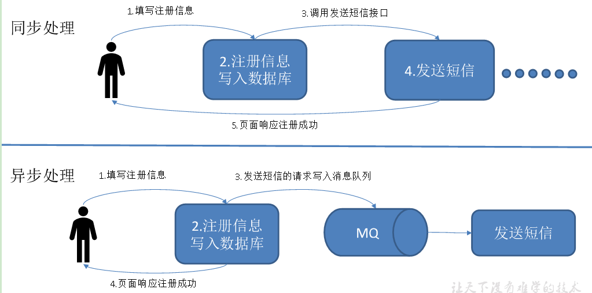  

使用消息队列的好处：

1. 解耦
    1. 允许你独立的扩展或修改两边的处理过程，只要确保它们遵守同样的接口约束。
2. 可恢复性
    1. 系统的一部分组件失效时，不会影响到整个系统。消息队列降低了进程间的耦合度，所以即使一个处理消息的进程挂掉，加入队列中的消息仍然可以在系统恢复后被处理。
3. 缓冲
    1. 有助于控制和优化数据流经过系统的速度，解决生产消息和消费消息的处理速度不一致的情况。
4. 灵活性 & 峰值处理能力
    1. 在访问量剧增的情况下，应用仍然需要继续发挥作用，但是这样的突发流量并不常见。如果为以能处理这类峰值访问为标准来投入资源随时待命无疑是巨大的浪费。使用消息队列能够使关键组件顶住突发的访问压力，而不会因为突发的超负荷的请求而完全崩溃。
5. 异步通信
    1. 很多时候，用户不想也不需要立即处理消息。消息队列提供了异步处理机制，允许用户把一个消息放入队列，但并不立即处理它。想向队列中放入多少消息就放多少，然后在需要的时候再去处理它们。

### 两种模式

1. 点对点模式（一对一，消费者主动拉取数据，消息收到后消息清除）
    * 消息生产者生产消息发送到Queue中，然后消息消费者从Queue中取出并且消费消息。
    * 消息被消费以后，queue中不再有存储，所以消息消费者不可能消费到已经被消费的消息。
    * Queue支持存在多个消费者，但是对一个消息而言，只会有一个消费者可以消费。
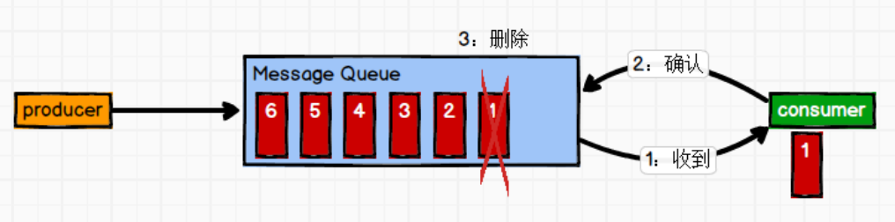  

2. 发布/订阅模式（一对多，消费者消费数据之后不会清除消息）
    * 消息生产者（发布）将消息发布到topic中，同时有多个消息消费者（订阅）消费该消息。
    * 和点对点方式不同，发布到topic的消息会被所有订阅者消费。    
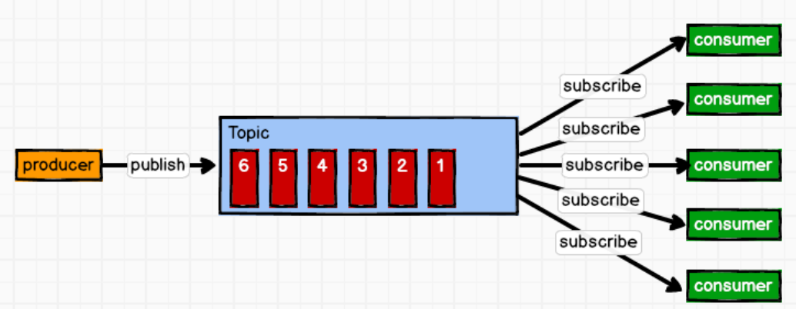  

## 基础架构

1. Producer ：消息生产者，就是向kafka broker发消息的客户端；
2. Consumer ：消息消费者，向Kafka broker取消息的客户端；
3. Consumer Group （CG. ：消费者组，由多个consumer组成。消费者组内每个消费者负责消费不同分区的数据，一个分区只能由一个组内消费者消费；消费者组之间互不影响。所有的消费者都属于某个消费者组，即消费者组是逻辑上的一个订阅者。
4. Broker ：一台kafka服务器就是一个broker。一个集群由多个broker组成。一个broker可以容纳多个topic。
5. Topic ：可以理解为一个队列，生产者和消费者面向的都是一个topic；
6. Partition：为了实现扩展性，一个非常大的topic可以分布到多个broker（即服务器. 上，一个topic可以分为多个partition，每个partition是一个有序的队列；
7. Replica：副本，为保证集群中的某个节点发生故障时，该节点上的partition数据不丢失，且kafka仍然能够继续工作，kafka提供了副本机制，一个topic的每个分区都有若干个副本，一个leader和若干个follower。
8. Leader：每个分区多个副本的“主”，生产者发送数据的对象，以及消费者消费数据的对象都是leader。
9. Follower：每个分区多个副本中的“从”，实时从leader中同步数据，保持和leader数据的同步。leader发生故障时，某个follower会成为新的leader。
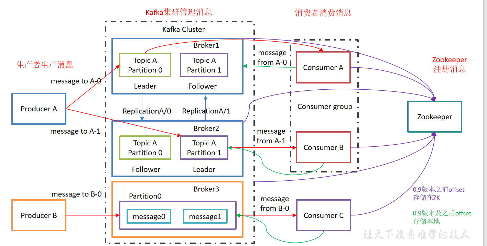  

## 工作流程及文件存储机制

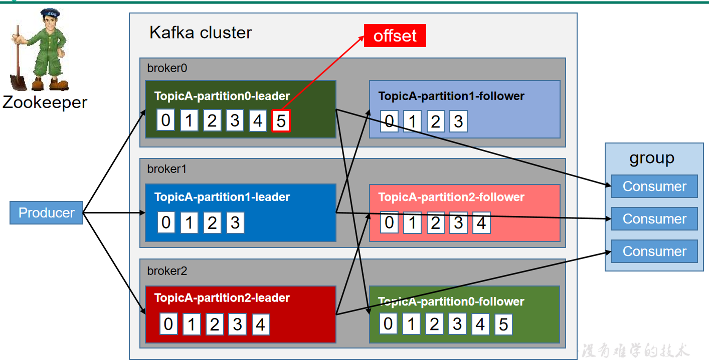  

Kafka中消息是以topic进行分类的，生产者生产消息，消费者消费消息，都是面向topic的。<br/>
topic是逻辑上的概念，而partition是物理上的概念，每个partition对应于一个log文件，
该log文件中存储的就是producer生产的数据。<br/>
Producer生产的数据会被不断追加到该log文件末端，且每条数据都有自己的offset。<br/>
消费者组中的每个消费者，都会实时记录自己消费到了哪个offset，以便出错恢复时，从上次的位置继续消费。
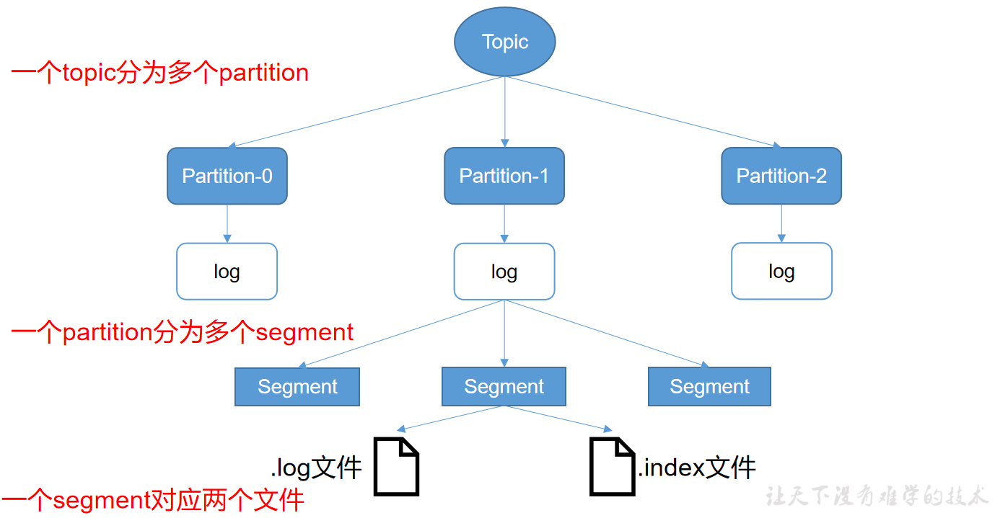 

由于生产者生产的消息会不断追加到log文件末尾，为防止log文件过大导致数据定位效率低下，
Kafka采取了分片和索引机制，将每个partition分为多个segment。<br/>
每个segment对应两个文件——“.index”文件和“.log”文件。<br/>
这些文件位于一个文件夹下，该文件夹的命名规则为：topic名称+分区序号。<br/>
例如，first这个topic有三个分区，则其对应的文件夹为first-0,first-1,first-2。
```
00000000000000000000.index
00000000000000000000.log
00000000000000170410.index
00000000000000170410.log
00000000000000239430.index
00000000000000239430.log
```
index和log文件以当前segment的第一条消息的offset命名。下图为index文件和log文件的结构示意图。
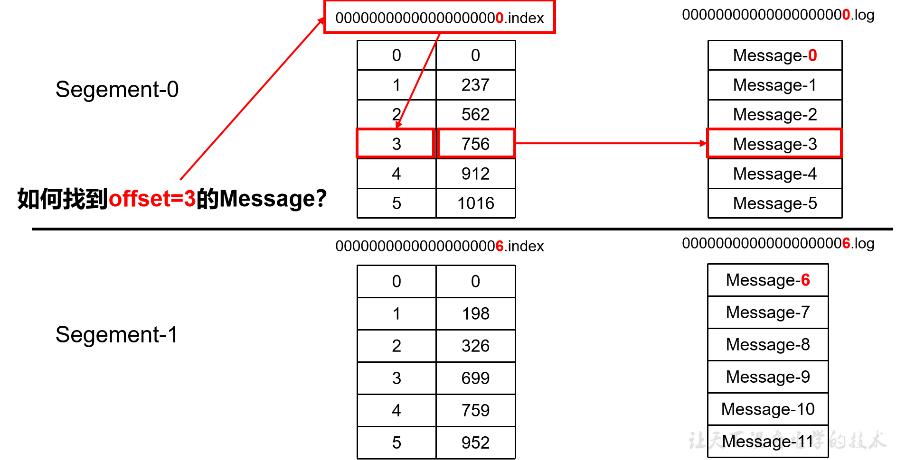 
“.index”文件存储大量的索引信息，“.log”文件存储大量的数据，
索引文件中的元数据指向对应数据文件中message的物理偏移地址。

## 生产者

### 分区策略

1. 分区的原因
    1. 方便在集群中扩展，每个Partition可以通过调整以适应它所在的机器，而一个topic又可以有多个Partition组成，因此整个集群就可以适应任意大小的数据了；
    2. 可以提高并发，因为可以以Partition为单位读写了。
2. 分区的原则
    1. 指明 partition 的情况下，直接将指明的值直接作为 partiton 值；
    2. 没有指明 partition 值但有 key 的情况下，将 key 的 hash 值与 topic 的 partition 数进行取余得到 partition 值；
    3. 既没有 partition 值又没有 key 值的情况下，第一次调用时随机生成一个整数（后面每次调用在这个整数上自增），将这个值与 topic 可用的 partition 总数取余得到 partition 值，也就是常说的 round-robin 算法。
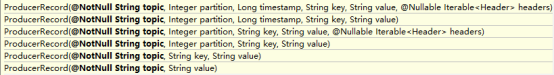 

### 数据可靠性保证

**为保证producer发送的数据，能可靠的发送到指定的topic，
topic的每个partition收到producer发送的数据后，都需要向producer发送ack（acknowledgement确认收到），
如果producer收到ack，就会进行下一轮的发送，否则重新发送数据。**
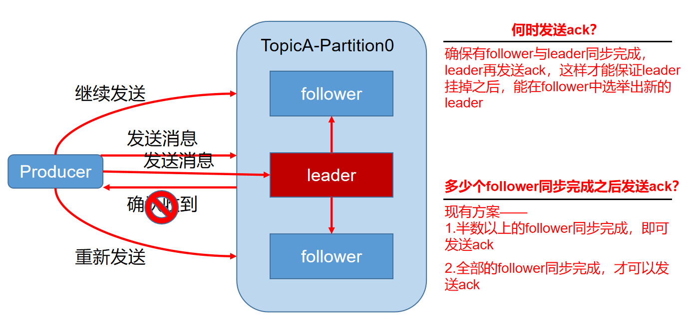 

| 方案                        | 优点                                     | 缺点                                      |
| ------------------------------------- | -------------------------------------------------- | --------------------------------------------------- |
|  半数以上完成同步，就发送ack | 延迟低                                             | 选举新的leader时，容忍n台节点的故障，需要2n+1个副本 |
| 全部完成同步，才发送ack     | 选举新的leader时，容忍n台节点的故障，需要n+1个副本 | 延迟高                                              |

Kafka选择了第二种方案，原因如下：
1. 同样为了容忍n台节点的故障，第一种方案需要2n+1个副本，而第二种方案只需要n+1个副本，而Kafka的每个分区都有大量的数据，第一种方案会造成大量数据的冗余。
2. 虽然第二种方案的网络延迟会比较高，但网络延迟对Kafka的影响较小。

ISR：<br/>
采用第二种方案之后，设想以下情景：leader收到数据，所有follower都开始同步数据，
但有一个follower，因为某种故障，迟迟不能与leader进行同步，那leader就要一直等下去，
直到它完成同步，才能发送ack。这个问题怎么解决呢？<br/>
Leader维护了一个动态的in-sync replica set (ISR)，意为和leader保持同步的follower集合。<br/>
当ISR中的follower完成数据的同步之后，leader就会给producer发送ack。<br/>
如果follower长时间未向leader同步数据，则该follower将被踢出ISR，
该时间阈值由replica.lag.time.max.ms参数设定。Leader发生故障之后，就会从ISR中选举新的leader。


ack应答机制

对于某些不太重要的数据，对数据的可靠性要求不是很高，能够容忍数据的少量丢失，
所以没必要等ISR中的follower全部接收成功。

所以Kafka为用户提供了三种可靠性级别，用户根据对可靠性和延迟的要求进行权衡，选择以下的配置。

acks参数配置：

acks：

* 0：producer不等待broker的ack，这一操作提供了一个最低的延迟，
broker一接收到还没有写入磁盘就已经返回，当broker故障时有可能丢失数据；
* 1：producer等待broker的ack，partition的leader落盘成功后返回ack，
如果在follower同步成功之前leader故障，那么将会丢失数据；
* -1（all）：producer等待broker的ack，partition的leader和follower全部落盘成功后才返回ack。
但是如果在follower同步完成后，broker发送ack之前，leader发生故障，那么会造成数据重复。

故障处理细节

LEO：指的是每个副本最大的offset；

HW：指的是消费者能见到的最大的offset，ISR队列中最小的LEO。

（1）follower故障

follower发生故障后会被临时踢出ISR，待该follower恢复后，follower会读取本地磁盘记录的上次的HW，
并将log文件高于HW的部分截取掉，从HW开始向leader进行同步。
等该follower的LEO大于等于该Partition的HW，即follower追上leader之后，就可以重新加入ISR了。

（2）leader故障

leader发生故障之后，会从ISR中选出一个新的leader，之后，为保证多个副本之间的数据一致性，
其余的follower会先将各自的log文件高于HW的部分截掉，然后从新的leader同步数据。

注意：这只能保证副本之间的数据一致性，并不能保证数据不丢失或者不重复。

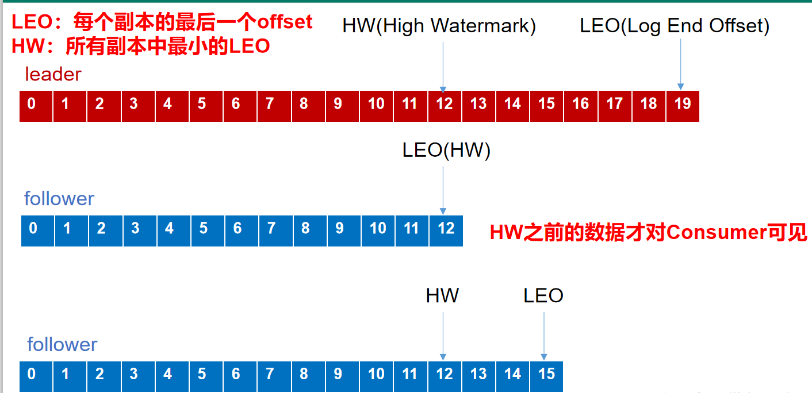 

## 消费者

### 消费方式

consumer采用pull（拉）模式从broker中读取数据。

push（推）模式很难适应消费速率不同的消费者，因为消息发送速率是由broker决定的。
它的目标是尽可能以最快速度传递消息，但是这样很容易造成consumer来不及处理消息，
典型的表现就是拒绝服务以及网络拥塞。

而pull模式则可以根据consumer的消费能力以适当的速率消费消息。

pull模式不足之处是，如果kafka没有数据，消费者可能会陷入循环中，一直返回空数据。
针对这一点，Kafka的消费者在消费数据时会传入一个时长参数timeout，
如果当前没有数据可供消费，consumer会等待一段时间之后再返回，这段时长即为timeout

### 分区分配策略

一个consumer group中有多个consumer，
一个 topic有多个partition，所以必然会涉及到partition的分配问题，
即确定那个partition由哪个consumer来消费。

Kafka有两种分配策略，一是RoundRobin，一是Range。

RoundRobin
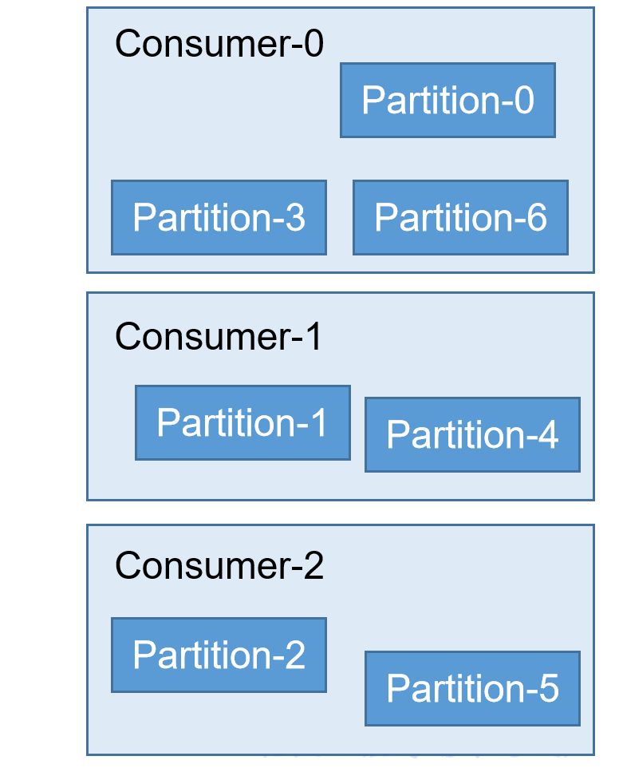 

Range
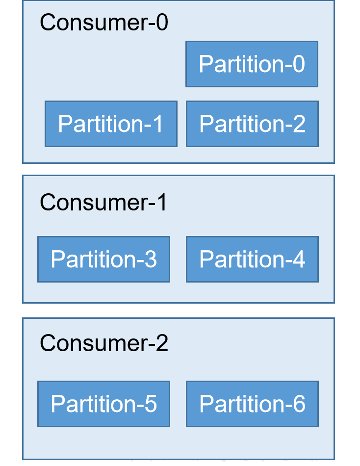 


### offset的维护

__consumer_offsets

## 高效写

* 顺序写磁盘
* 零拷贝
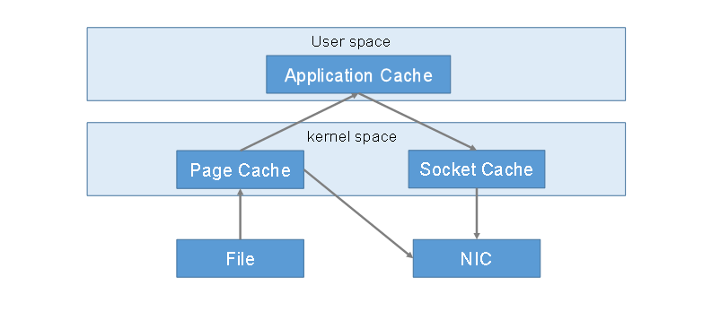 

## Zookeeper的作用

Kafka集群中有一个broker会被选举为Controller，
负责管理集群broker的上下线，
所有topic的分区副本分配和leader选举等工作。
Controller的管理工作都是依赖于Zookeeper的。

以下为partition的leader选举过程：
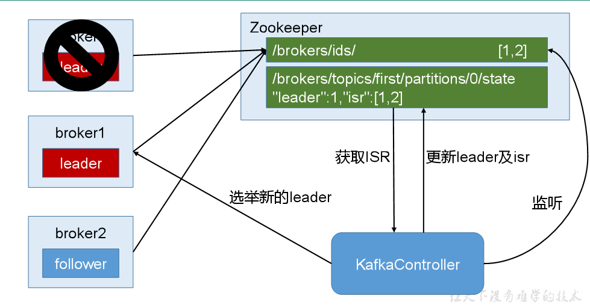 

	
## 消息发送流程

* Kafka的Producer发送消息采用的是异步发送的方式。
* 在消息发送的过程中，涉及到了两个线程——main线程和Sender线程，以及一个线程共享变量——RecordAccumulator。
* main线程将消息发送给RecordAccumulator，Sender线程不断从RecordAccumulator中拉取消息发送到Kafka broker。
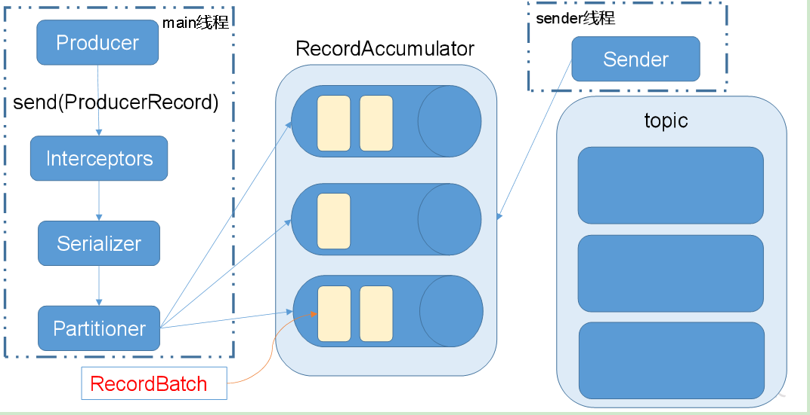 

相关参数：
* batch.size：只有数据积累到batch.size之后，sender才会发送数据。
* linger.ms：如果数据迟迟未达到batch.size，sender等待linger.time之后就会发送数据。

## 企业面试
1. Kafka中的ISR、AR又代表什么？
    ISR：与leader保持同步的follower集合
    AR：分区的所有副本
2. Kafka中的HW、LEO等分别代表什么？
    LEO：每个副本的最后条消息的offset
    HW：一个分区中所有副本最小的offset
3. Kafka中是怎么体现消息顺序性的？
    每个分区内，每条消息都有一个offset，故只能保证分区内有序。
4. Kafka中的分区器、序列化器、拦截器是否了解？它们之间的处理顺序是什么？
    拦截器 -> 序列化器 -> 分区器
5. Kafka生产者客户端的整体结构是什么样子的？使用了几个线程来处理？分别是什么？

6. “消费组中的消费者个数如果超过topic的分区，那么就会有消费者消费不到数据”这句话是否正确？
    正确
7. 消费者提交消费位移时提交的是当前消费到的最新消息的offset还是offset+1？
    offset+1
8. 有哪些情形会造成重复消费？
 
9. 那些情景会造成消息漏消费？
    先提交offset，后消费，有可能造成数据的重复
10. 当你使用kafka-topics.sh创建（删除）了一个topic之后，Kafka背后会执行什么逻辑？
    1）会在zookeeper中的/brokers/topics节点下创建一个新的topic节点，如：/brokers/topics/first
    2）触发Controller的监听程序
    3）kafka Controller 负责topic的创建工作，并更新metadata cache
11. topic的分区数可不可以增加？如果可以怎么增加？如果不可以，那又是为什么？
可以增加
bin/kafka-topics.sh --zookeeper localhost:2181/kafka --alter --topic topic-config --partitions 3
12. topic的分区数可不可以减少？如果可以怎么减少？如果不可以，那又是为什么？
    不可以减少，现有的分区数据难以处理。
13. Kafka有内部的topic吗？如果有是什么？有什么所用？
    __consumer_offsets,保存消费者offset
14. Kafka分区分配的概念？
    一个topic多个分区，一个消费者组多个消费者，故需要将分区分配个消费者(roundrobin、range)
15. 简述Kafka的日志目录结构？
    每个分区对应一个文件夹，文件夹的命名为topic-0，topic-1，内部为.log和.index文件
16. 如果我指定了一个offset，Kafka Controller怎么查找到对应的消息？
    
17. 聊一聊Kafka Controller的作用？
    负责管理集群broker的上下线，所有topic的分区副本分配和leader选举等工作。
18. Kafka中有那些地方需要选举？这些地方的选举策略又有哪些？
    partition leader（ISR），controller（先到先得）
19. 失效副本是指什么？有那些应对措施？
    不能及时与leader同步，暂时踢出ISR，等其追上leader之后再重新加入
20. Kafka的那些设计让它有如此高的性能？
    分区，顺序写磁盘，0-copy