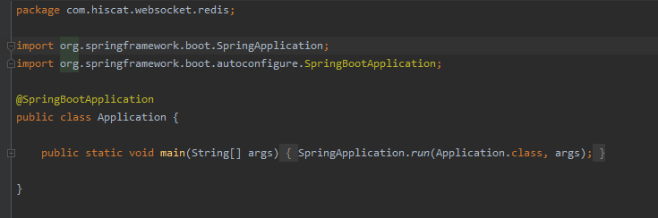

# 利用Redis搭建Websocket集群

## 思路

1. 将websocket的发布/订阅转移至Redis的发布/订阅（只要是提供发布/订阅机制的中间件即可）
2. 部署websocket节点时，会部署多个，节点之间无法感知对方的存在，主题之间无法广播消息，需要利用外部的发布/订阅机制进行广播。
3. websocket订阅什么主题，redis就订阅什么主题
4. websocket向什么主题发布消息，redis就向什么主题发布消息。

## 准备环境

1. Redis（docker安装也行）
2. Idea 2019.3
3. 网络畅通

## 搭建websocket环境

1. 目录结构

   1. 

2. pom.xml

   1. ```xml
      <?xml version="1.0" encoding="UTF-8"?>
      <project xmlns="http://maven.apache.org/POM/4.0.0" xmlns:xsi="http://www.w3.org/2001/XMLSchema-instance"
               xsi:schemaLocation="http://maven.apache.org/POM/4.0.0 https://maven.apache.org/xsd/maven-4.0.0.xsd">
          <modelVersion>4.0.0</modelVersion>
          <parent>
              <groupId>org.springframework.boot</groupId>
              <artifactId>spring-boot-starter-parent</artifactId>
              <version>2.2.2.RELEASE</version>
              <relativePath/> <!-- lookup parent from repository -->
          </parent>
          <groupId>com.hiscat</groupId>
          <artifactId>websocke-redis</artifactId>
          <version>0.0.1-SNAPSHOT</version>
          <name>websocke-redis</name>
          <description>websocke-redis</description>
      
          <properties>
              <java.version>1.8</java.version>
          </properties>
      
          <dependencies>
              <dependency>
                  <groupId>org.webjars</groupId>
                  <artifactId>webjars-locator-core</artifactId>
              </dependency>
              <dependency>
                  <groupId>org.webjars</groupId>
                  <artifactId>sockjs-client</artifactId>
                  <version>1.0.2</version>
              </dependency>
              <dependency>
                  <groupId>org.webjars</groupId>
                  <artifactId>stomp-websocket</artifactId>
                  <version>2.3.3</version>
              </dependency>
              <dependency>
                  <groupId>org.webjars</groupId>
                  <artifactId>bootstrap</artifactId>
                  <version>3.3.7</version>
              </dependency>
              <dependency>
                  <groupId>org.webjars</groupId>
                  <artifactId>jquery</artifactId>
                  <version>3.1.0</version>
              </dependency>
              <dependency>
                  <groupId>org.springframework.boot</groupId>
                  <artifactId>spring-boot-starter-data-redis</artifactId>
              </dependency>
              <dependency>
                  <groupId>org.springframework.boot</groupId>
                  <artifactId>spring-boot-starter-websocket</artifactId>
              </dependency>
      
              <dependency>
                  <groupId>org.springframework.boot</groupId>
                  <artifactId>spring-boot-devtools</artifactId>
                  <scope>runtime</scope>
                  <optional>true</optional>
              </dependency>
              <dependency>
                  <groupId>org.springframework.boot</groupId>
                  <artifactId>spring-boot-configuration-processor</artifactId>
                  <optional>true</optional>
              </dependency>
              <dependency>
                  <groupId>org.projectlombok</groupId>
                  <artifactId>lombok</artifactId>
                  <optional>true</optional>
              </dependency>
              <dependency>
                  <groupId>org.springframework.boot</groupId>
                  <artifactId>spring-boot-starter-test</artifactId>
                  <scope>test</scope>
                  <exclusions>
                      <exclusion>
                          <groupId>org.junit.vintage</groupId>
                          <artifactId>junit-vintage-engine</artifactId>
                      </exclusion>
                  </exclusions>
              </dependency>
          </dependencies>
      
          <build>
              <plugins>
                  <plugin>
                      <groupId>org.springframework.boot</groupId>
                      <artifactId>spring-boot-maven-plugin</artifactId>
                  </plugin>
              </plugins>
          </build>
      
      </project>
      
      ```

      

3. 其余类结构

   1. RedisConfig

      

   2. WebsocketConfig

      

   3. GreetingController

      

   4. 消息类

      

      
      
   5. 启动类
   
      
   
   6. app.js
   
      1. ```js
         var stompClient = null;
         
         function setConnected(connected) {
             $("#connect").prop("disabled", connected);
             $("#disconnect").prop("disabled", !connected);
             if (connected) {
                 $("#conversation").show();
             }
             else {
                 $("#conversation").hide();
             }
             $("#greetings").html("");
         }
         
         function connect() {
             var socket = new SockJS('/gs-guide-websocket');
             stompClient = Stomp.over(socket);
             stompClient.connect({}, function (frame) {
                 setConnected(true);
                 console.log('Connected: ' + frame);
                 stompClient.subscribe('/topic/greetings', function (greeting) {
                     showGreeting(JSON.parse(greeting.body).content);
                 });
             });
         }
         
         function disconnect() {
             if (stompClient !== null) {
                 stompClient.disconnect();
             }
             setConnected(false);
             console.log("Disconnected");
         }
         
         function sendName() {
             stompClient.send("/app/hello/greetings", {}, JSON.stringify({'name': $("#name").val()}));
         }
         
         function showGreeting(message) {
             $("#greetings").append("<tr><td>" + message + "</td></tr>");
         }
         
         $(function () {
             $("form").on('submit', function (e) {
                 e.preventDefault();
             });
             $( "#connect" ).click(function() { connect(); });
             $( "#disconnect" ).click(function() { disconnect(); });
             $( "#send" ).click(function() { sendName(); });
         });
         ```
   
   7. index.html
   
      1. ```html
         <!DOCTYPE html>
         <html>
         <head>
             <title>Hello WebSocket</title>
             <link href="/webjars/bootstrap/css/bootstrap.min.css" rel="stylesheet">
             <link href="/main.css" rel="stylesheet">
             <script src="/webjars/jquery/3.1.0/jquery.js"></script>
             <script src="/webjars/sockjs-client/sockjs.min.js"></script>
             <script src="/webjars/stomp-websocket/stomp.min.js"></script>
             <script src="/app.js"></script>
         </head>
         <body>
         <noscript><h2 style="color: #ff0000">Seems your browser doesn't support Javascript! Websocket relies on Javascript being
             enabled. Please enable
             Javascript and reload this page!</h2></noscript>
         <div id="main-content" class="container">
             <div class="row">
                 <div class="col-md-6">
                     <form class="form-inline">
                         <div class="form-group">
                             <label for="connect">WebSocket connection:</label>
                             <button id="connect" class="btn btn-default" type="submit">Connect</button>
                             <button id="disconnect" class="btn btn-default" type="submit" disabled="disabled">Disconnect
                             </button>
                         </div>
                     </form>
                 </div>
                 <div class="col-md-6">
                     <form class="form-inline">
                         <div class="form-group">
                             <label for="name">What is your name?</label>
                             <input type="text" id="name" class="form-control" placeholder="Your name here...">
                         </div>
                         <button id="send" class="btn btn-default" type="submit">Send</button>
                     </form>
                 </div>
             </div>
             <div class="row">
                 <div class="col-md-12">
                     <table id="conversation" class="table table-striped">
                         <thead>
                         <tr>
                             <th>Greetings</th>
                         </tr>
                         </thead>
                         <tbody id="greetings">
                         </tbody>
                     </table>
                 </div>
             </div>
         </div>
         </body>
         </html>
         ```
   
   8. main.css
   
      ​	
   
      ```css
      body {
          background-color: #f5f5f5;
      }
      
      #main-content {
          max-width: 940px;
          padding: 2em 3em;
          margin: 0 auto 20px;
          background-color: #fff;
          border: 1px solid #e5e5e5;
          -webkit-border-radius: 5px;
          -moz-border-radius: 5px;
          border-radius: 5px;
      }	
      ```
   
   9. application.properties
   
      1. ```properties
         spring.redis.host=换成redis的ip
         ```
   
   10. 启动2个应用
   
       1. 
       2. 
       3. 打开网页，点击connect，发送消息可以看到2个节点之间消息共享
       4. 
       5. 

## 小结

 github地址：https://github.com/MyLanPangzi/java/tree/master/websocke-redis

**当多个节点需要通信时，但又无法感知对方时，可使用外部的发布/订阅机制。**

**如果需要广播，多播，则需要知道集群中其他节点的具体地址。**

## 参考文献

Redis发布/订阅：https://redis.io/topics/pubsub

Spring websocket：https://spring.io/guides/gs/messaging-stomp-websocket/

Message with redis：https://spring.io/guides/gs/messaging-redis/

