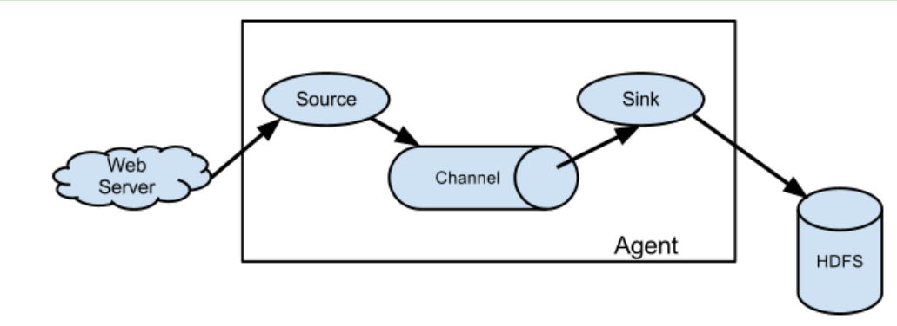
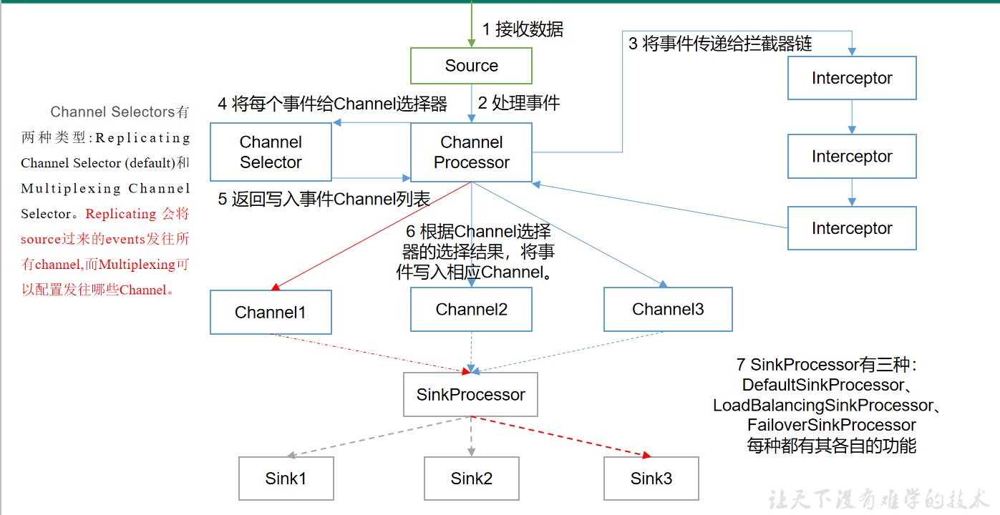
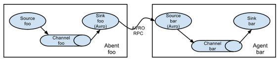
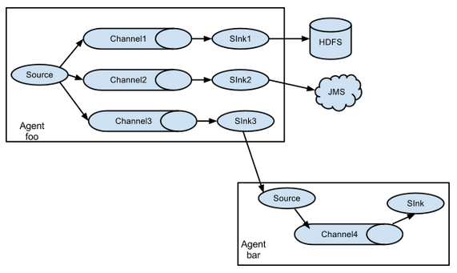
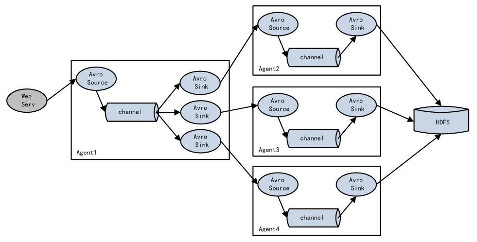
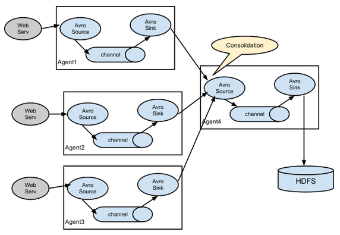
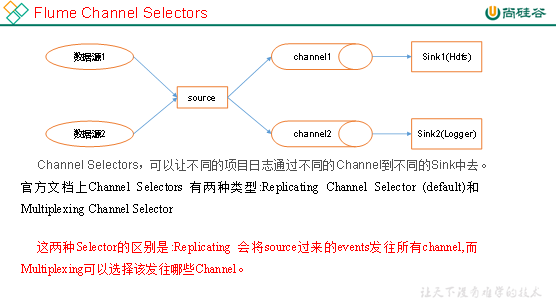

# Flume

[TOC]

## 概述

Flume是Cloudera提供的一个高可用的，高可靠的，分布式的海量日志采集、聚合和传输的系统。
Flume基于流式架构，灵活简单。

## 架构

  

* Agent
    * Agent是一个JVM进程，它以事件的形式将数据从源头送至目的。
    * Agent主要有3个部分组成，Source、Channel、Sink。
* Source
    * Source是负责接收数据到Flume Agent的组件。Source组件可以处理各种类型、各种格式的日志数据，
    包括avro、thrift、exec、jms、spooling directory、netcat、sequence generator、syslog、http、legacy。
* Channel
    * Channel是位于Source和Sink之间的缓冲区。因此，Channel允许Source和Sink运作在不同的速率上。Channel是线程安全的，可以同时处理几个Source的写入操作和几个Sink的读取操作。
    * Flume自带两种Channel：Memory Channel和File Channel以及Kafka Channel。
    * Memory Channel是内存中的队列。Memory Channel在不需要关心数据丢失的情景下适用。如果需要关心数据丢失，那么Memory Channel就不应该使用，因为程序死亡、机器宕机或者重启都会导致数据丢失。
    * File Channel将所有事件写到磁盘。因此在程序关闭或机器宕机的情况下不会丢失数据。
* Sink
    * Sink不断地轮询Channel中的事件且批量地移除它们，并将这些事件批量写入到存储或索引系统、或者被发送到另一个Flume Agent。
    * Sink组件目的地包括hdfs、logger、avro、thrift、ipc、file、HBase、solr、自定义。
* Event
    * 传输单元，Flume数据传输的基本单元，以Event的形式将数据从源头送至目的地。
    * Event由Header和Body两部分组成，Header用来存放该event的一些属性，为K-V结构，Body用来存放该条数据，形式为字节数组。

## Flume事务

## 内部原理

重要组件：

1. ChannelSelector
    * ChannelSelector的作用就是选出Event将要被发往哪个Channel。其共有两种类型，分别是Replicating（复制）和Multiplexing（多路复用）。
    * ReplicatingSelector会将同一个Event发往所有的Channel，Multiplexing会根据相应的原则，将不同的Event发往不同的Channel。
2. SinkProcessor
    * SinkProcessor共有三种类型，分别是DefaultSinkProcessor、LoadBalancingSinkProcessor和FailoverSinkProcessor
    * DefaultSinkProcessor对应的是单个的Sink，LoadBalancingSinkProcessor和FailoverSinkProcessor对应的是Sink Group，LoadBalancingSinkProcessor可以实现负载均衡的功能，FailoverSinkProcessor可以实现故障转移的功能。

  

## 拓扑结构

### 简单串联

这种模式是将多个flume顺序连接起来了，从最初的source开始到最终sink传送的目的存储系统。
此模式不建议桥接过多的flume数量，flume数量过多不仅会影响传输速率，
而且一旦传输过程中某个节点flume宕机，会影响整个传输系统。

  

### 复制和多路复用

Flume支持将事件流向一个或者多个目的地。这种模式可以将相同数据复制到多个channel中，
或者将不同数据分发到不同的channel中，sink可以选择传送到不同的目的地。
  

### 负载均衡和故障转移

Flume支持使用将多个sink逻辑上分到一个sink组，
sink组配合不同的SinkProcessor可以实现负载均衡和错误恢复的功能。
  

### 聚合

这种模式是我们最常见的，也非常实用，日常web应用通常分布在上百个服务器，
大者甚至上千个、上万个服务器。产生的日志，处理起来也非常麻烦。
用flume的这种组合方式能很好的解决这一问题，每台服务器部署一个flume采集日志，
传送到一个集中收集日志的flume，再由此flume上传到hdfs、hive、hbase等，进行日志分析。
  

## 面试题

1. 你是如何实现Flume数据传输的监控的
    * 使用第三方框架Ganglia实时监控Flume。

2. Flume的Source，Sink，Channel的作用？你们Source是什么类型？
    1. 作用
        * Source组件是专门用来收集数据的，可以处理各种类型、各种格式的日志数据，包括avro、thrift、exec、jms、spooling directory、netcat、sequence generator、syslog、http、legacy
        * Channel组件对采集到的数据进行缓存，可以存放在Memory或File中。
        * Sink组件是用于把数据发送到目的地的组件，目的地包括HDFS、Logger、avro、thrift、ipc、file、Hbase、solr、自定义。
    2. 我公司采用的Source类型为
        1. 监控后台日志：exec
        2. 监控后台产生日志的端口：netcat Exec  spooldir
3. Flume的Channel Selectors

  

4. Flume参数调优
    1. Source
        * 增加Source个（使用Tair Dir Source时可增加FileGroups个数）可以增大Source的读取数据的能力。例如：当某一个目录产生的文件过多时需要将这个文件目录拆分成多个文件目录，同时配置好多个Source 以保证Source有足够的能力获取到新产生的数据。
        * batchSize参数决定Source一次批量运输到Channel的event条数，适当调大这个参数可以提高Source搬运Event到Channel时的性能。
    2. Channel 
        * type 选择memory时Channel的性能最好，但是如果Flume进程意外挂掉可能会丢失数据。type选择file时Channel的容错性更好，但是性能上会比memory channel差。
        * 使用file Channel时dataDirs配置多个不同盘下的目录可以提高性能。
        * Capacity 参数决定Channel可容纳最大的event条数。transactionCapacity 参数决定每次Source往channel里面写的最大event条数和每次Sink从channel里面读的最大event条数。transactionCapacity需要大于Source和Sink的batchSize参数。
    3. Sink 
        * 增加Sink的个数可以增加Sink消费event的能力。Sink也不是越多越好够用就行，过多的Sink会占用系统资源，造成系统资源不必要的浪费。
        * batchSize参数决定Sink一次批量从Channel读取的event条数，适当调大这个参数可以提高Sink从Channel搬出event的性能。
5. Flume的事务机制
    * Flume的事务机制（类似数据库的事务机制）：
    Flume使用两个独立的事务分别负责从Soucrce到Channel，以及从Channel到Sink的事件传递。
    比如spooling directory source 为文件的每一行创建一个事件，
    一旦事务中所有的事件全部传递到Channel且提交成功，那么Soucrce就将该文件标记为完成。
    同理，事务以类似的方式处理从Channel到Sink的传递过程，如果因为某种原因使得事件无法记录，
    那么事务将会回滚。且所有的事件都会保持到Channel中，等待重新传递。
6. Flume采集数据会丢失吗?
    * 根据Flume的架构原理，Flume是不可能丢失数据的，其内部有完善的事务机制
    ，Source到Channel是事务性的，Channel到Sink是事务性的，
    因此这两个环节不会出现数据的丢失，唯一可能丢失数据的情况是Channel采用memoryChannel，
    agent宕机导致数据丢失，或者Channel存储数据已满，导致Source不再写入，未写入的数据丢失。
    Flume不会丢失数据，但是有可能造成数据的重复，
    例如数据已经成功由Sink发出，但是没有接收到响应，Sink会再次发送数据，此时可能会导致数据的重复。