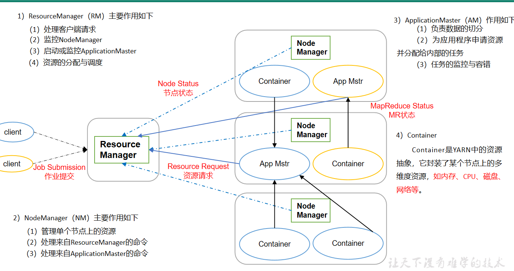

# Hadoop

[TOC]

Hadoop是分布式系统基础架构

## 优点

1. 高可靠
2. 高扩展
3. 高效
4. 高容错

## 1.x VS 2.x

1. 2.x增加了YARN，解耦业务逻辑运算与资源调度，MapReduce只负责计算。
2. 集群间数据拷贝
3. 小文件存档

## 常用配置文件

1. hadoop-env.sh
2. mapred-env.sh
3. yarn-env.sh
4. core-site.xml
5. hdfs-site.xml
6. mapred-site.xml
7. yarn-site.xml

## HDFS

### What

Hadoop分布式文件系统，负责存储数据。

### 架构


### 写数据流程

1. 向NN发送上传文件请求，NN检查是否可以上传
2. NN应答可以上传
3. Client请求上传第一个Block
4. NN返回上传DN节点，dn1，dn2，dn3
5. Client请求dn1上传文件，dn1与dn2，dn2与dn3建立管道连接
6. dn3，dn2，dn1逐级应答
7. Client开始上传第一个Block，以Packet为单位，dn1发送至dn2，dn2发送至dn3，dn1每传一个Packet会放入一个应答队列等待应答
8. Client上传完第一个Block后，再上传第二个，如此往复


1. 在HDFS写数据的过程中，NameNode会选择距离待上传数据最近距离的DataNode接收数据。
2. 节点距离：两个节点到达最近的共同祖先的距离总和。
3. 副本存储节点选择
4. For the common case, when the replication factor is three, HDFS’s placement policy is to put one replica on one node in the local rack, another on a different node in the local rack, and the last on a different node in a different rack.

### 读数据流程

1. 客户端通过Distributed FileSystem向NameNode请求下载文件，NameNode通过查询元数据，找到文件块所在的DataNode地址。
2. 挑选一台DataNode（就近原则，然后随机）服务器，请求读取数据。
3. DataNode开始传输数据给客户端（从磁盘里面读取数据输入流，以Packet为单位来做校验）
4. 客户端以Packet为单位接收，先在本地缓存，然后写入目标文件。


### Client

1. 文件分片
2. 与NameNode交互，获取文件位置
3. 与DataNode交互，读写数据
4. 提供HDFS命令进行管理

### NameNode

1. 存储文件的元数据，如文件名，大小，路径，创建时间，副本数，文件权限。
2. 管理HDFS名称空间
3. 管理数据映射信息
4. 控制客户端的读写请求

#### 文件块

1. **2.x默认大小是128，大小设置取决于磁盘传输速率。**
2. 不能设置太小，会增加寻址时间，（大量小文件会耗费NameNode存储空间）
3. 不能设置太大，会增加传输时间
4. 寻址时间与传输时间比值为1%最合适

#### NN和SNN工作机制

内存+磁盘的形式存储元数据。

1. NN启动时生成新的edits.inprogress，然后内存中合并fsimage+edits文件
2. 客户端写请求时，追加到磁盘中的edits.inprogress文件，同时更新内存中fsimage
3. SNN定时询问，然后抓取fsimage以及edits进行合并，然后推送至NN


- fsimage：NameNode内存中元数据序列化后形成的文件。
- edits：记录客户端更新元数据信息的每一步操作
- edits.inprogress当前正在写入的edits文件 
- fsimage.chkpoint：SNN合并后推送到NN的新fsimage
- oiv查看fsimage文件
- oev查看edits文件

#### CheckPoint时间设置

1. SecondaryNameNode一小时执行一次

2. 操作次数达到1百万时执行一次

3. ```xml
   <property>
     <name>dfs.namenode.checkpoint.period</name>
     <value>3600</value>
   </property>
   <property>
     <name>dfs.namenode.checkpoint.txns</name>
     <value>1000000</value>
     <description>操作动作次数</description>
   </property>
   ```

#### NameNode故障处理

1. 删除NN下的data/tmp/name/dfs目录
2. 拷贝SNN的data/tmp/name/dfs的数据至NN同样的路径下

#### 安全模式

1. NN启动时，合并fsimage与edits，生成新fsimage以及edits，然后开始监听DN的请求，整个过程中都是安全模式，文件系统是只读的。
2. DN启动时主动上报文件列表
3. 满足最小副本条件，30秒后退出安全模式，即集群99.9%的文件块满足最小副本数(默认是1，dfs.replication.min=1)。新格式化的集群不会进入安全模式。

#### 多目录配置

1. 每个目录存放的内容是相同的，增加可靠性，每个目录可以挂载不同的磁盘。

### SecondaryNameNode

1. 监控NameNode的状态，定时抓取edit以及fimage进行合并，然后推送至NameNode。
2. 特殊情况下，可用于恢复NameNode数据，注意：会丢失数据。

### DataNode

1. 存储文件块，以及校验和
2. 负责读写

#### 工作机制

1. 数据以文件块形式存储在DataNode的磁盘上，数据+校验文件
2. DN启动后主动上报所有文件块信息至NN
3. 3秒一次心跳，接受NN的操作命令，10分钟无心跳，认为节点下线


#### 数据完整性

1. DN读取Block时计算CheckSum
2. 如果CheckSum与校验和文件不一致，则Block损坏
3. Client读取其他DN上的Block
4. DN周期性的验证CheckSum

#### 掉线时长参数设置

```xml
<property>
    <name>dfs.namenode.heartbeat.recheck-interval</name>
    <value>300000</value>
</property>
<property>
    <name>dfs.heartbeat.interval</name>
    <value>3</value>
</property>
```


#### 服役新节点

直接加机器就完事了。

#### 退役旧节点

1. 白名单退役（不推荐）

   1. etc/hadoop/下增加dfs.hosts文件

      ```
      hadoop102
      hadoop103
      hadoop104
      ```

   2. hdfs-site.xml

      ```xml
      <property>
          <name>dfs.hosts</name>
          <value>/opt/module/hadoop-2.7.2/etc/hadoop/dfs.hosts</value>
      </property>
      ```

   3. 分发文件，刷新NN，RM

      ```
      hdfs dfsadmin -refreshNodes
      yarn rmadmin -refreshNodes
      start-balancer.sh
      ```

2. 黑名单退役（推荐，数据会平衡）

   1. etc/hadoop下增加dfs.hosts.exclude文件

      ```
      hadoop105
      ```

   2. hdfs-site.xml

      ```xml
      <property>
      	<name>dfs.hosts.exclude</name>
          <value>/opt/module/hadoop-2.7.2/etc/hadoop/dfs.hosts.exclude</value>
      </property>
      ```

   3. 分发文件，刷新NN，RM

      ```
      hdfs dfsadmin -refreshNodes
      yarn rmadmin -refreshNodes
      start-balancer.sh
      ```

#### 多目录配置

1. dn多目录配置，每个目录存储不一样的数据，磁盘容量不足时，可以加磁盘扩容

   ```xml
   <property>
     <name>dfs.datanode.data.dir</name>
     <value>file:///${hadoop.tmp.dir}/dfs/data1,file:///${hadoop.tmp.dir}/dfs/data2</value>
   </property>
   ```

### HA

#### NameNode HA

1. 元数据管理方式需要改变
   1. 内存中各自保存一份元数据；
   2. Edits日志只有Active状态的NameNode节点可以做写操作；
   3. 两个NameNode都可以读取Edits；
   4. 共享的Edits放在一个共享存储中管理（qjournal和NFS两个主流实现）；
2. 需要一个状态管理功能模块（zkfailover）
3. 必须保证两个NameNode之间能够ssh无密码登录
4. 隔离（Fence），即同一时刻仅仅有一个NameNode对外提供服务

##### **自动故障转移**

依赖ZK:

1. **故障检测**（监听机制）
2. **现役NameNode选择**（锁机制）
3. **健康监测**（心跳机制)
4. **ZooKeeper 会话管理**(临时节点，锁机制)
5. **基于 ZooKeeper 的选择**（锁机制）


#### ResourceManager HA


## MapReduce

### 概述

#### 定义


#### 优缺点

优点：

1.  MapReduce 易于编程。实现一些接口，就可以完成一个分布式程序。
2. 良好的扩展性。计算资源不足时，可以增加机器扩展计算能力。
3. 高容错性。任务失败可以转移到其他节点重新计算。
4. 适合PB级以上海量数据的离线处理。可在成千上万的节点上进行计算。

缺点：

1. 不擅长实时计算。无法在毫秒或者秒级内返回结果。
2. 不擅长流式计算。输入数据集是静态的，有边界的，不能是无边界的数据。
3. 不擅长DAG（有向图）计算。因为计算结果要写入磁盘，任务依赖会导致大量的磁盘IO，效率会变得低下。

#### 核心思想

1. 分布式的运算程序往往需要分成至少2个阶段。
2. 第一个阶段的MapTask并发实例，完全并行运行，互不相干。
3. 第二个阶段的ReduceTask并发实例互不相干，但是他们的数据依赖于上一个阶段的所有MapTask并发实例的输出。
4. MapReduce编程模型只能包含一个Map阶段和一个Reduce阶段，如果用户的业务逻辑非常复杂，那就只能多个MapReduce程序，串行运行。

#### MR进程


#### 常用数据序列化类型


#### MR编程规范

用户编写的程序分成三个部分：Mapper、Reducer和Driver。


### 序列化


### 框架原理

#### InputFormat

1. MapTask的并行度决定Map阶段的任务处理并发度，进而影响到整个Job的处理速度。
2. MapTask并行度决定机制
   1. 数据块：Block是HDFS物理上把数据分成一块一块。
   2. 数据切片：数据切片只是在逻辑上对输入进行分片，并不会在磁盘上将其切分成片进行存储。


#### Job提交源码分析


#### FileInputFormat


#### TextInputFormat


#### CombineTextInputFormat


#### KeyValueTextInputFormat


#### NLineInputFormat


#### 自定义InputFormat


#### MapReduce工作流程


#### Shuffle

1. Partition
2. WritableComparable
   1. 
   2. 
   3. 
3. Combiner
4. GroupingComparator


#### OutputFormat


#### Join


### MapReduce开发总结


### 数据压缩

#### 概述


#### MR支持的压缩编码


#### 压缩方式选择

* Gzip压缩 
* Bzip2压缩 
* Lzo压缩 
* Snappy压缩 

#### 压缩位置选择


#### 压缩参数配置

|   参数   |   默认值   |   阶段   |  建议    |
| ---- | ---- | ---- | ---- |
| io.compression.codecs <br />（在core-site.xml中配置） | org.apache.hadoop.io.compress.DefaultCodec, org.apache.hadoop.io.compress.GzipCodec, org.apache.hadoop.io.compress.BZip2Codec | 输入压缩 | Hadoop使用文件扩展名判断是否支持某种编解码器 |
| mapreduce.map.output.compress<br />（在mapred-site.xml中配置） |  | mapper输出 | 这个参数设为true启用压缩 |
| mapreduce.map.output.compress.codec<br />（在mapred-site.xml中配置） | false | mapper输出 | 企业多使用LZO或Snappy编解码器在此阶段压缩数据 |
| mapreduce.output.fileoutputformat.compress<br />（在mapred-site.xml中配置） | org.apache.hadoop.io.compress.DefaultCodec | reducer输出 | 这个参数设为true启用压缩 |
| mapreduce.output.fileoutputformat.compress.codec<br />（在mapred-site.xml中配置） | false | reducer输出 | 使用标准工具或者编解码器，如gzip和bzip2 |
| mapreduce.output.fileoutputformat.compress.type<br />（在mapred-site.xml中配置） | org.apache.hadoop.io.compress. DefaultCodec | reducer输出 | SequenceFile输出使用的压缩类型：NONE和BLOCK |

### 企业优化

#### MapReduce跑的慢的原因


#### MapReduce优化方法

MapReduce优化方法主要从六个方面考虑：数据输入、Map阶段、Reduce阶段、IO传输、数据倾斜问题和常用的调优参数。

1. 数据输入 
2. Map阶段  
3. Reduce阶段   
4. IO传输  
5. 数据倾斜问题  
6. 常用的调优参数  

#### HDFS小文件优化方法

##### HDFS小文件弊端

HDFS上每个文件都要在NameNode上建立一个索引，这个索引的大小约为150byte，这样当小文件比较多的时候，就会产生很多的索引文件，一方面会大量占用NameNode的内存空间，另一方面就是索引文件过大使得索引速度变慢。

##### HDFS小文件解决方案

1. 在数据采集的时候，就将小文件或小批数据合成大文件再上传HDFS。
2. 在业务处理之前，在HDFS上使用MapReduce程序对小文件进行合并。
3. 在MapReduce处理时，可采用CombineTextInputFormat提高效率。


## YARN

### 架构



### 工作流

1. MR程序提交到客户端所在的节点。
2. YarnRunner向ResourceManager申请一个Application。
3. RM将该应用程序的资源路径返回给YarnRunner。
4. 该程序将运行所需资源提交到HDFS上。
5. 程序资源提交完毕后，申请运行mrAppMaster。
6. RM将用户的请求初始化成一个Task。
7. 其中一个NodeManager领取到Task任务。
8. 该NodeManager创建容器Container，并产生MRAppmaster。
9. Container从HDFS上拷贝资源到本地。
10. MRAppmaster向RM 申请运行MapTask资源。
11. RM将运行MapTask任务分配给另外两个NodeManager，另两个NodeManager分别领取任务并创建容器。
12. MrAppMaster向两个接收到任务的NodeManager发送程序启动脚本，这两个NodeManager分别启动MapTask，MapTask对数据分区排序。
13. MrAppMaster等待所有MapTask运行完毕后，向RM申请容器，运行ReduceTask。
14. ReduceTask向MapTask获取相应分区的数据。
15. 程序运行完毕后，MR会向RM申请注销自己。


### 资源调度器

#### FIFO 

 

#### Capacity 

特点：

* 容量保证。管理员可为每个队列设置资源最低保证和资源使用上限，而所有提交到该队列的应用程序共享这些资源。
* 灵活性，如果一个队列中的资源有剩余，可以暂时共享给那些需要资源的队列，而一旦该队列有新的应用程序提交，则其他队列释放的资源会归还给该队列。这种资源灵活分配的方式可明显提高资源利用率。
* 多重租赁。支持多用户共享集群和多应用程序同时运行。为防止单个应用程序、用户或者队列独占集群中的资源，管理员可为之增加多重约束（比如单个应用程序同时运行的任务数等）。
* 安全保证。每个队列有严格的ACL列表规定它的访问用户，每个用户可指定哪些用户允许查看自己应用程序的运行状态或者控制应用程序（比如杀死应用程序）。此外，管理员可指定队列管理员和集群系统管理员。
* 动态更新配置文件。管理员可根据需要动态修改各种配置参数，以实现在线集群管理。


#### Fair 

特点：
* 资源公平共享。在每个队列中，Fair Scheduler 可选择按照FIFO、Fair或DRF策略为应用程序分配资源。其中，Fair 策略(默认)是一种基于最大最小公平算法实现的资源多路复用方式，默认情况下，每个队列内部采用该方式分配资源。这意味着，如果一个队列中有两个应用程序同时运行，则每个应用程序可得到1/2的资源；如果三个应用程序同时运行，则每个应用程序可得到1/3的资源。
* 支持资源抢占。当某个队列中有剩余资源时，调度器会将这些资源共享给其他队列，而当该队列中有新的应用程序提交时，调度器要为它回收资源。为了尽可能降低不必要的计算浪费，调度器采用了先等待再强制回收的策略，即如果等待一段时间后尚有未归还的资源，则会进行资源抢占：从那些超额使用资源的队列中杀死一部分任务，进而释放资源。
* 负载均衡。Fair Scheduler提供了一个基于任务数目的负载均衡机制，该机制尽可能将系统中的任务均匀分配到各个节点上。此外，用户也可以根据自己的需要设计负载均衡机制。
* 调度策略配置灵活。Fair Scheduler允许管理员为每个队列单独设置调度策略（当前支持FIFO、Fair或DRF三种）。
* 提高小应用程序响应时间。由于采用了最大最小公平算法，小作业可以快速获取资源并运行完成

 

