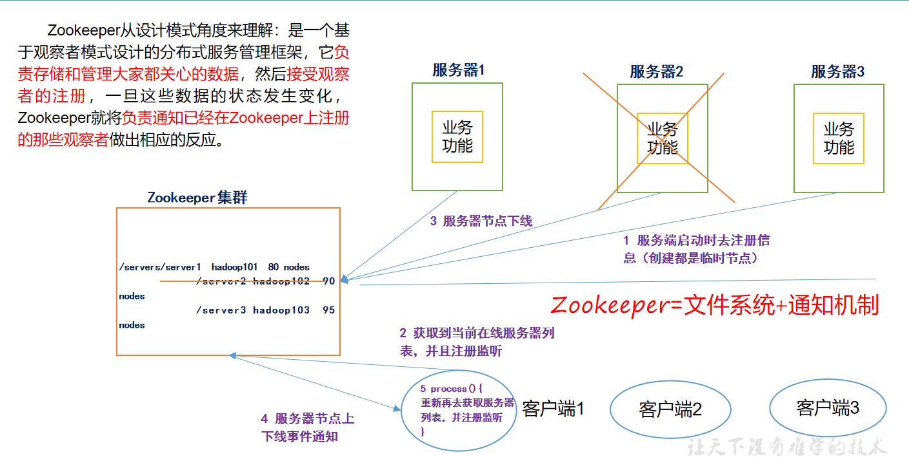
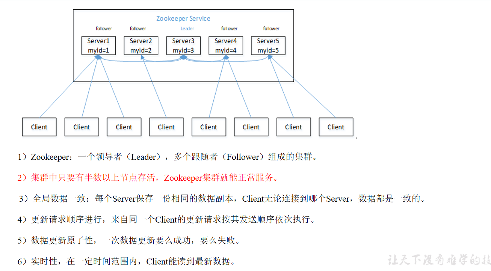
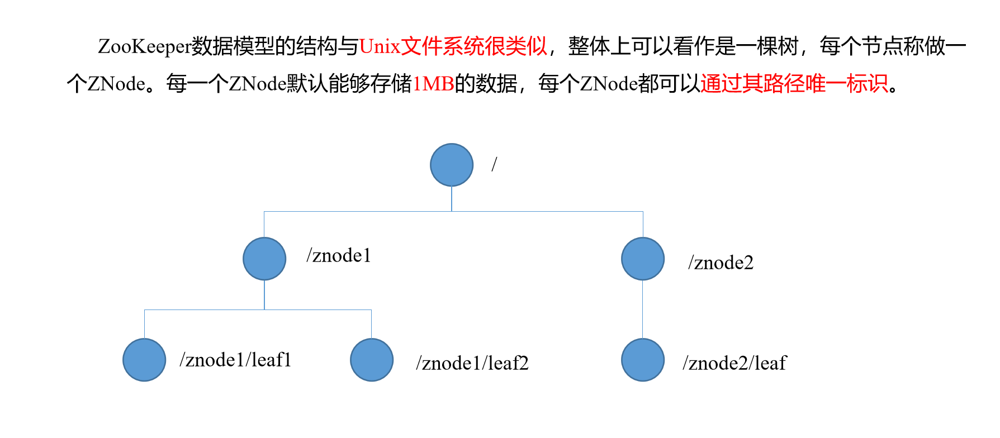
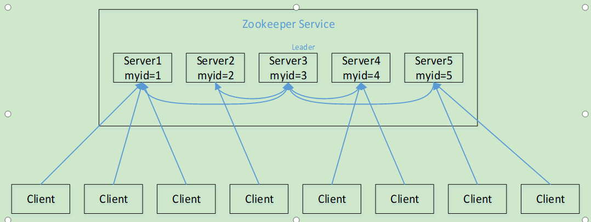
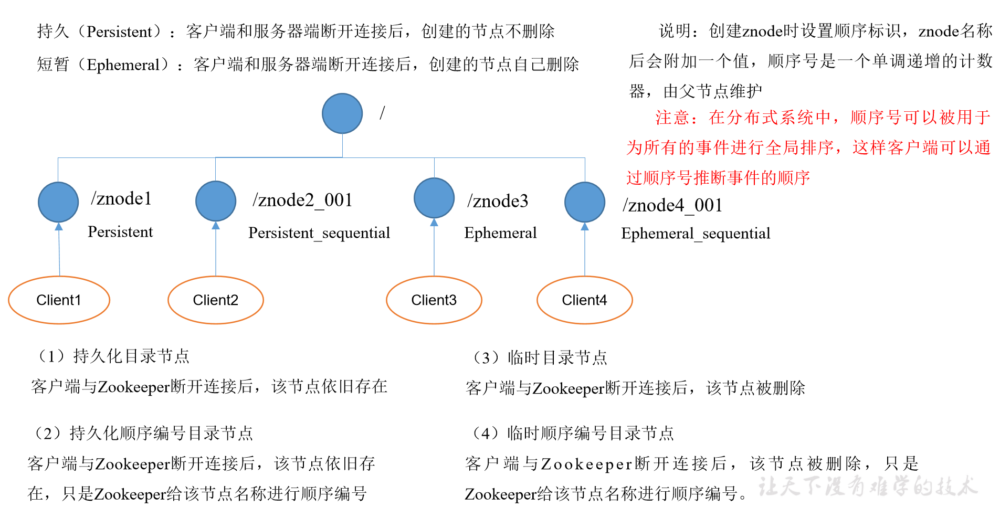
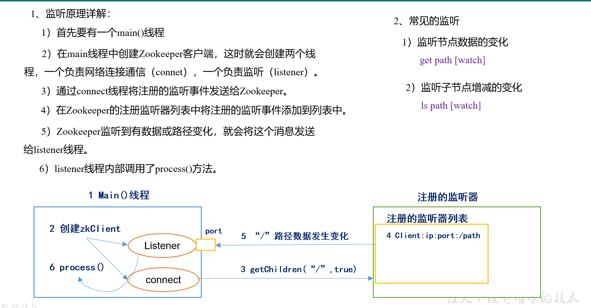
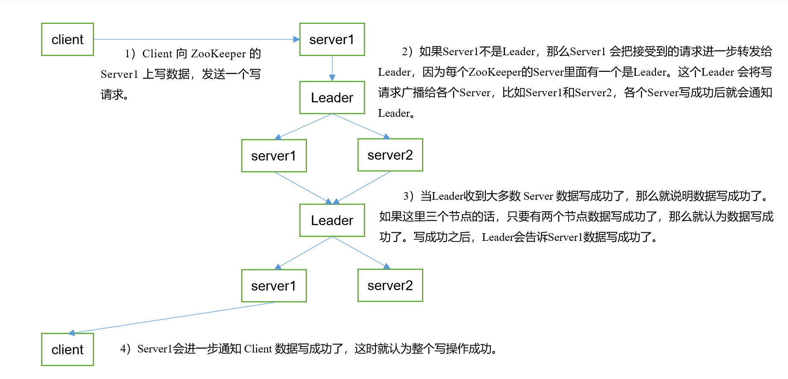

# Zookeeper

[TOC]

## 概述

Zookeeper分布式协调服务，多作为集群提供服务的中间件.   
Zookeeper从设计模式角度来理解，是一个基于观察者模式设计的分布式服务管理框架，
它负责存储和管理大家都关心的数据，然后接受观察者的注册，一旦这些数据的状态发生了变化，
Zookeeper就负责通知已经在Zookeeper上注册的那些观察者做出相应的反应.

Zookeeper = 文件系统 + 通知机制

 

## 特点

 

## 数据结构

  

## 应用场景

提供的服务包括：
* 统一命名服务
* 统一配置管理 
* 统一集群管理
* 服务器节点动态上下线
* 软负载均衡

## 选举机制

1. 半数机制：集群中半数以上机器存活，集群可用。所以Zookeeper适合安装奇数台服务器。
2. Zookeeper虽然在配置文件中并没有指定Master和Slave。但是，Zookeeper工作时，是有一个节点为Leader，其他则为Follower，Leader是通过内部的选举机制临时产生的。
3. 以一个简单的例子来说明整个选举的过程。

假设有五台服务器组成的Zookeeper集群，它们的id从1-5，同时它们都是最新启动的，
也就是没有历史数据，在存放数据量这一点上，都是一样的。假设这些服务器依序启动，来看看会发生什么，如图5-8所示。

  

1. 服务器1启动，此时只有它一台服务器启动了，它发出去的报文没有任何响应，所以它的选举状态一直是LOOKING状态。
2. 服务器2启动，它与最开始启动的服务器1进行通信，互相交换自己的选举结果，由于两者都没有历史数据，所以id值较大的服务器2胜出，但是由于没有达到超过半数以上的服务器都同意选举它(这个例子中的半数以上是3)，所以服务器1、2还是继续保持LOOKING状态。
3. 服务器3启动，根据前面的理论分析，服务器3成为服务器1、2、3中的老大，而与上面不同的是，此时有三台服务器选举了它，所以它成为了这次选举的Leader。
4. 服务器4启动，根据前面的分析，理论上服务器4应该是服务器1、2、3、4中最大的，但是由于前面已经有半数以上的服务器选举了服务器3，所以它只能接收当小弟的命了。
5. 服务器5启动，同4一样当小弟。

## 节点类型

  

## Stat结构体

1. czxid-创建节点的事务zxid
    1. 每次修改ZooKeeper状态都会收到一个zxid形式的时间戳，也就是ZooKeeper事务ID。
    2. 事务ID是ZooKeeper中所有修改总的次序。每个修改都有唯一的zxid，如果zxid1小于zxid2，那么zxid1在zxid2之前发生。
2. ctime - znode被创建的毫秒数(从1970年开始)
3. mzxid - znode最后更新的事务zxid
4. mtime - znode最后修改的毫秒数(从1970年开始)
5. pZxid-znode最后更新的子节点zxid
6. cversion - znode子节点变化号，znode子节点修改次数
7. dataversion - znode数据变化号
8. aclVersion - znode访问控制列表的变化号
9. ephemeralOwner- 如果是临时节点，这个是znode拥有者的session id。如果不是临时节点则是0。
10. dataLength- znode的数据长度
11. numChildren - znode子节点数量

## 监听原理

  

## 写数据流

  

## 企业面试

1. 请简述ZooKeeper的选举机制
    1. 半数选举机制
2. ZooKeeper的监听原理是什么？
    1. 连接线程+监听线程
3. ZooKeeper的部署方式有哪几种？集群中的角色有哪些？集群最少需要几台机器？
    1. 部署方式单机模式、集群模式
    2. 角色：Leader和Follower
    3. 集群最少需要机器数：3
4. ZooKeeper的常用命令
    1. ls create get delete set…